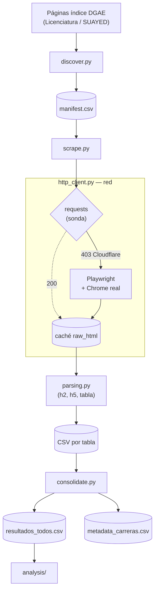

# Resultados UNAM (DGAE) a CSV

Extrae a archivos CSV los resultados del Concurso de Selección de Ingreso a
Licenciatura de la UNAM, publicados por la DGAE, para los años 2021 a 2026 y sus
modalidades. Habilita comparativas entre años por carrera, campus y modalidad.

La fuente son páginas HTML públicas.

---

## Glosario

| Sigla | Significado |
|---|---|
| **UNAM** | Universidad Nacional Autónoma de México |
| **DGAE** | Dirección General de Administración Escolar (publica los resultados) |
| **SUAYED** | Sistema Universidad Abierta y Educación a Distancia |
| **DOM** | Document Object Model — estructura del HTML de una página |
| **HTML** | HyperText Markup Language — formato de las páginas de origen |
| **CSV** | Comma-Separated Values — formato de salida tabular |
| **HTTP** | HyperText Transfer Protocol — protocolo de las peticiones de red |
| **AIMD** | Additive Increase / Multiplicative Decrease — esquema del throttle |
| **KDE** | Kernel Density Estimation — densidad usada en el análisis |
| **CDP** | Chrome DevTools Protocol — canal de control del navegador |

---

## Qué hace

Tres fases independientes y reanudables:

1. **Descubrimiento** (`discover.py`): recorre las páginas índice de cada año y
   modalidad, y construye `manifest.csv` con una fila por tabla.
2. **Extracción** (`scrape.py`): descarga cada tabla, cachea el HTML crudo,
   parsea metadata y tabla, y guarda un CSV por tabla.
3. **Consolidación** (`consolidate.py`): concatena todo en CSV maestros.



---

## Entorno

Ejecución local en un ambiente conda.

- **Python 3.11**
- **Paquetería** (conda-forge): `requests`, `beautifulsoup4`, `lxml`, `pandas`
- **Playwright** (pip): requerido para atravesar el reto JavaScript de Cloudflare
  (ver "Comportamiento de red")
- **Google Chrome o Microsoft Edge** instalado en el sistema: el navegador se
  maneja vía `channel="chrome"`

### Setup

```bash
conda env create -f environment.yml      # crea el env 'unam-scraper' (Python 3.11)
conda activate unam-scraper
pip install playwright
playwright install chromium
```

---

## Estructura del sitio de origen (fuente de verdad)

Verificado en vivo para 2026. Para años anteriores hay que validar antes de
bajar en masa (ver "Validación por año").

### Páginas índice

Dos árboles según la modalidad:

| Árbol | Modalidad | Patrón de URL |
|---|---|---|
| Licenciatura | escolarizado / abierta | `https://www.dgae.unam.mx/Licenciatura{AÑO}/resultados/{AREA}{MOD}.html` |
| SUAYED | a distancia | `https://www.dgae.unam.mx/Suayed{AÑO}/Licenciatura/resultados/{AREA}{MOD}.html` |

Nomenclatura `{AREA}{MOD}.html`:

- Primer dígito = **área** (1, 2, 3, 4).
- Segundo dígito = **modalidad**: `5` = escolarizado, `6` = abierta / SUAYED.
- No existe `16` (no hay modalidad abierta en el área 1).

Ejemplo para 2026:

| Árbol | Modalidad | Índices existentes |
|---|---|---|
| `Licenciatura2026/resultados/` | escolarizado | 15, 25, 35, 45 |
| `Licenciatura2026/resultados/` | abierta | 26, 36, 46 |
| `Suayed2026/Licenciatura/resultados/` | suayed | 26, 36, 46 |

Advertencia: `26`, `36` y `46` **existen en los dos árboles** con modalidades
distintas (abierta vs. distancia). El nombre del archivo índice no es único por
sí solo. Llavea por `(año, árbol, archivo)`.

No infieras la modalidad del dígito. Cada índice trae la etiqueta literal en el
`<title>` (`ResultadosAREA 2 ABIERTO`, `ResultadosAREA 1 ESCOLARIZADO`) y en el
`<h2>` (`... (Modalidad Abierta)`). Deriva la modalidad de ahí y usa el dígito
solo como verificación.

### Contenido de un índice

Cada carrera es un separador `<h3>` seguido de uno o más botones:

```html
<a class="btn btn-link waves-effect waves-light" href="...tabla...">FACULTAD DE CIENCIAS</a>
```

La leyenda del botón es el **campus**; su `href` (ya absoluto) lleva a la tabla.
Los grupos van separados por `<hr>`.

### Páginas de tabla

Viven en `.../resultados/{area}/{codigo}.html` (por ejemplo
`.../resultados/1/10100035.html`). Contienen:

- `<h2>`: `Concurso Licenciatura 2026 : (101) ACTUARIA - FACULTAD DE CIENCIAS - Escolarizado`.
- `<h5>` de metadata: `Oferta=70 Aspirantes=1614 Presentaron Examen=1395 Aciertos Minimos=113 Seleccionados=86`.
- `<h5>` de leyenda: `S=Seleccionado N=No presentado C=Cancelado Sin Letra=No Seleccionado`.
- `<table>` con columnas: `Número de comprobante | Aciertos | Acreditado | Detalles | Diagnóstico`.

Reglas de parseo:

- **Descarta** la fila placeholder `no se encontraron resultados para la búsqueda`.
- **Elimina** la columna `Diagnóstico` (enlace `javascript:nuevaVentana(...)` con
  token constante por página, sin valor por fila).
- **Conserva** `Detalles`.
- `Aciertos` puede venir vacío. `Acreditado` toma `S`, `N`, `C` o vacío.
- Fuerza **UTF-8** en lectura y escritura.

---

## Estructura del proyecto

```
unam-resultados/
├── README.md
├── CLAUDE.md
├── environment.yml
├── src/
│   ├── config.py             # años, áreas, modalidades, throttle, rutas, headers
│   ├── discover.py           # Fase 1 -> data/manifest.csv
│   ├── scrape.py             # Fase 2 -> data/tables/{año}/{modalidad}/*.csv
│   ├── consolidate.py        # Fase 3 -> data/consolidated/*.csv
│   ├── http_client.py        # sesión, throttle adaptativo, backoff, caché
│   └── parsing.py            # parseo de índice, h2, h5 y tabla
├── data/
│   ├── manifest.csv
│   ├── raw_html/{año}/{tree}/…        # tablas; índices en {año}/_index/{tree}/
│   ├── tables/{año}/{modalidad}/…
│   └── consolidated/
│       ├── resultados_todos.csv
│       └── metadata_carreras.csv
└── logs/scrape.log
```

---

## Configuración (`config.py`)

- `YEARS`: `[2021, 2022, 2023, 2024, 2025, 2026]`.
- `AREAS`: `[1, 2, 3, 4]`.
- `MODALIDADES`: `{5: "escolarizado", 6: "abierta"}`, más el árbol SUAYED aparte.
- `BASE_LICENCIATURA = "https://www.dgae.unam.mx/Licenciatura{year}/resultados/"`
- `BASE_SUAYED = "https://www.dgae.unam.mx/Suayed{year}/Licenciatura/resultados/"`
- Throttle: `DELAY_MIN = 0.25`, `DELAY_START = 1.5`, `DELAY_MAX = 30.0`,
  `DELAY_DECAY = 0.9`, `DELAY_BACKOFF = 3.0`, `SUCCESS_STREAK = 5`.
- `HEADERS`: cabeceras de navegador.
- Fallback de navegador: `FETCH_MODE = "auto"` (`auto` / `always` / `never`),
  `BROWSER_CHANNEL = "chrome"`, `BROWSER_HEADLESS = False`,
  `CHALLENGE_TIMEOUT = 90.0`, `BROWSER_PROFILE_DIR = data/.browser_profile`.
- Rutas de salida.

---

## Uso

```bash
conda activate unam-scraper

# Fase 1: manifiesto (rápido, pocas páginas)
python -m src.discover

# Fase 2: prueba puntual antes de escalar
python -m src.scrape --solo 10100035
python -m src.scrape --year 2026
python -m src.scrape                     # todo

# Fase 3
python -m src.consolidate
```

Cada fase es reanudable: si la cortas y la relanzas, retoma donde iba.

---

## Replicación paso a paso

Secuencia con la que se bajaron y consolidaron los seis años (2021–2026).

### 0. Requisitos del sistema

- **Miniconda/Anaconda** con Python 3.11.
- **Google Chrome (o Microsoft Edge) instalado** en el sistema. El navegador se
  maneja vía `channel="chrome"` (ver "Comportamiento de red").

### 1. Ambiente

```bash
conda env create -f environment.yml      # crea el env 'unam-scraper' (Python 3.11)
conda activate unam-scraper
pip install playwright                    # requerido (Cloudflare); no está en conda-forge
playwright install chromium               # binarios de respaldo de Playwright
```

> El navegador que atraviesa Cloudflare es el **Chrome real del sistema**
> (`channel="chrome"`), no el Chromium de Playwright; aun así, `playwright install
> chromium` deja el paquete listo.

### 2. Fase 1 — Descubrimiento (por año)

```bash
python -m src.discover --year 2026        # ~10 páginas índice; construye/mergea el manifiesto
```

- Al **primer hit** se abre una **ventana de Chrome**. Si aparece la pantalla
  "Un momento…" de Cloudflare con la casilla de verificación, **haz un click**;
  la clearance (`cf_clearance`) se guarda en el perfil persistente y las páginas
  siguientes la heredan.
- Revisa a mano el resumen por año/árbol/modalidad que imprime al final, y
  `data/manifest.csv`: número de carreras y campus por índice, modalidades bien
  etiquetadas, URLs sanas.
- `discover` **mergea por año**: preserva las filas de años ya descubiertos.

### 3. Validación por año (obligatoria antes de escalar)

Antes de bajar un año en masa, valida que su DOM coincide con el de 2026:

```bash
python -m src.scrape --solo 10100035 --year 2026   # baja UNA tabla
```

Confirma en el CSV resultante (`data/tables/{año}/{modalidad}/…`): columnas
correctas, contexto inyectado, `acreditado` en {S, N, C, vacío}, y **cero**
rastros de `Diagnóstico`/`javascript`/placeholder. Si el DOM difiriera, hay que
ramificar `parsing.py` para ese año (no fue necesario en 2021–2026: DOM idéntico).

### 4. Fase 2 — Extracción (barrido completo del año)

```bash
python -m src.scrape --year 2026          # baja las ~200-220 tablas del año
```

- Abre Chrome y baja de forma **secuencial** con throttle adaptativo (~4 s/tabla,
  ~15–20 min por año). Puede pedir un click humano si Cloudflare re-desafía.
- **Reanudable e idempotente**: toda tabla con CSV ya existente se salta; toda
  descarga cacheada no se re-baja. Si se corta, relanza el mismo comando.
- Al final reporta `ok / skip / empty / fail`. Las `fail` (pendientes) se
  reintentan solo con relanzar (no re-trabaja las ya hechas).

### 5. Repite 2–4 para cada año

```bash
for y in 2025 2024 2023 2022 2021; do
  python -m src.discover --year $y
  python -m src.scrape   --solo 10100035 --year $y   # validación puntual
  python -m src.scrape   --year $y                   # barrido completo
done
```

(En la práctica se corrió año por año, revisando cada uno.)

### 6. Fase 3 — Consolidación (una vez, al final)

```bash
python -m src.consolidate                 # todos los años presentes en data/tables
```

Genera `resultados_todos.csv` y `metadata_carreras.csv`, y **canonicaliza**
carrera/campus (ver "Esquema de datos"). Re-parsea la metadata desde el HTML
cacheado, así que tarda algunos minutos con los seis años.

### 7. Validación de integridad

La suma de `aspirantes` en `metadata_carreras.csv` debe ser **idéntica** al total
de filas de `resultados_todos.csv`. Si no cuadra, falta alguna tabla.

```python
import pandas as pd
res  = pd.read_csv("data/consolidated/resultados_todos.csv", dtype=str, keep_default_na=False)
meta = pd.read_csv("data/consolidated/metadata_carreras.csv", dtype=str, keep_default_na=False)
assert int(pd.to_numeric(meta["aspirantes"]).sum()) == len(res)
```

### Resultado de referencia (2021–2026)

| Año | Tablas | Filas (aspirantes) |
|---|---|---|
| 2021 | 199 | 191,692 |
| 2022 | 203 | 201,604 |
| 2023 | 209 | 201,542 |
| 2024 | 210 | 181,739 |
| 2025 | 212 | 196,194 |
| 2026 | 220 | 191,306 |
| **Total** | **1,253** | **1,164,077** |

DOM idéntico los seis años (sin ramificar el parseo); 0 fallos, 0 pendientes,
0 tablas vacías en todos los barridos.

---

## Repositorio y datos

El repo versiona el **código y el agregado**, no los datos pesados (que se
regeneran con el pipeline).

**Se versiona:**

- Todo `src/`, `analysis/`, `environment.yml`, `README.md`, `CLAUDE.md`.
- `data/manifest.csv` — índice de todas las tablas (chico).
- `data/consolidated/metadata_carreras.csv` — agregado por carrera-campus-año.
- `analysis/output/` — el gráfico (HTML/PNG) y su tabla resumen.

**No se versiona** (en `.gitignore`, se regenera):

- `data/raw_html/` — caché de HTML crudo (cientos de MB).
- `data/tables/` — los 1253 CSV por tabla.
- `data/consolidated/resultados_todos.csv` — ~90 MB, **supera el límite de
  100 MB de GitHub**. Ver abajo cómo publicarlo aparte.
- `data/.browser_profile/` — perfil del navegador (cookies de Cloudflare).

### Clonar y reconstruir

```bash
git clone https://github.com/jmtoral/admisiones_unam.git
cd admisiones_unam
conda env create -f environment.yml && conda activate unam-scraper
pip install playwright && playwright install chromium
# Reconstruye los datos (re-scrapea; ver "Replicación paso a paso"):
python -m src.discover
python -m src.scrape
python -m src.consolidate
```

---

## Throttle adaptativo

No hay delay fijo ni ventana horaria. El scraper va tan rápido como el servidor
tolere y desacelera solo cuando el servidor lo indica. Es más rápido que un
delay conservador y a la vez evita quedar bloqueado a media corrida.

Algoritmo (AIMD invertido, en `http_client.py`):

- Estado: `delay` actual, inicializado en `DELAY_START` (1.5 s).
- **Éxito** (`200`): incrementa el contador de racha. Al llegar a
  `SUCCESS_STREAK` peticiones limpias consecutivas, multiplica el delay por
  `DELAY_DECAY` (0.9) y reinicia la racha. Nunca por debajo de `DELAY_MIN`.
- **Señal de rechazo** (`429`, `503`, `403`, timeout, o cuerpo con reto
  anti-bot): multiplica el delay por `DELAY_BACKOFF` (3.0), tope `DELAY_MAX`,
  reinicia la racha, y reintenta esa URL. Si viene `Retry-After`, úsalo como
  piso de espera.
- **Reintentos**: hasta 5 por URL. Si se agotan, registra el fallo en el log,
  marca la URL como pendiente y continúa con la siguiente. No abortes la corrida
  completa por una tabla.
- Jitter aleatorio de ±20 % sobre el delay, para no generar un patrón
  perfectamente periódico.
- Loguea cada cambio de delay, para poder auditar a qué ritmo se estabilizó.

Peticiones **secuenciales**. No paralelices: la concurrencia contra un mismo
host es lo que dispara los filtros anti-bot, y el throttle adaptativo pierde
sentido si varios hilos lo mueven a la vez.

`robots.txt`: léelo una vez al inicio y regístralo en el log de forma
informativa. El `Crawl-delay` no gobierna el throttle. Si hay un `Disallow`
explícito sobre las rutas de resultados, repórtalo en el log para que sea una
decisión consciente.

---

## Comportamiento de red

**El sitio está detrás de Cloudflare con reto JavaScript ("Un momento…").**
Verificado en vivo para 2026: cualquier cliente HTTP plano —incluso con
cabeceras de navegador perfectas— recibe **HTTP 403** con la página de reto. El
reto no es filtro de cabeceras ni de TLS que se pueda falsear con `requests`:
exige ejecutar JavaScript. Por eso el navegador real (Playwright) no es un
fallback opcional, sino el **motor de descarga principal**.

La arquitectura sigue siendo "requests primero, navegador si bloquea", solo que
aquí el bloqueo es constante:

1. **`requests.Session`** con cabeceras de navegador (ver `config.HEADERS`) es la
   **sonda inicial**. Mantiene cookies y `Referer` con la URL del índice al pedir
   una tabla. En este sitio, la sonda casi siempre devuelve 403.

2. **Escalado a navegador**: al primer rechazo (403 / cuerpo con reto), el
   cliente escala a Playwright y **se queda en navegador el resto de la corrida**
   (`FETCH_MODE="auto"`). Así solo se desperdicia una sonda, no cinco reintentos
   por URL contra un muro que no cede.

3. **Navegador real, no headless.** El fallback maneja el Chrome/Edge instalado
   vía `channel="chrome"`, con **ventana visible** (`headless=False`). El modo
   headless se queda atorado en el Managed Challenge de Cloudflare; la ventana
   visible lo atraviesa. Se usa un **perfil persistente** (`BROWSER_PROFILE_DIR`)
   para guardar la cookie `cf_clearance`: solo el **primer hit** de la sesión
   paga el reto; las demás páginas y áreas la heredan.

   ```python
   from playwright.sync_api import sync_playwright

   with sync_playwright() as p:
       ctx = p.chromium.launch_persistent_context(
           user_data_dir=str(BROWSER_PROFILE_DIR),
           channel="chrome", headless=False, locale="es-MX",
           args=["--disable-blink-features=AutomationControlled"],
       )
       page = ctx.pages[0] if ctx.pages else ctx.new_page()
       page.goto(url, wait_until="domcontentloaded")
       # Espera activa hasta que el <title> deje de ser "Un momento…".
       html = page.content()
       ctx.close()
   ```

4. **Puede requerir un click humano.** En el primer hit de una sesión, Cloudflare
   puede mostrar la casilla "verificar que soy humano". Con la ventana visible,
   se resuelve con un click; después la clearance se hereda. **El barrido no es
   100 % desatendido**: abre una ventana de Chrome y ocasionalmente pide
   interacción.

5. **Caché obligatoria**: guarda el HTML crudo (ya renderizado por el navegador)
   en `data/raw_html/{año}/`. Si el archivo existe, se lee en vez de descargar.
   Cada página se baja una sola vez; esto permite re-parsear sin re-descargar y
   reanudar tras una interrupción.

6. **Throttle en ambos caminos**: el throttle adaptativo se aplica igual a la
   sonda de requests y a la navegación con Playwright.

`FETCH_MODE` controla la estrategia: `"auto"` (sonda requests → escala a
navegador; default), `"always"` (navegador de entrada) o `"never"` (solo
requests; útil para re-parsear desde caché sin red).

---

## Esquema de datos

### `data/manifest.csv`

| Columna | Descripción |
|---|---|
| `year` | Año del concurso |
| `tree` | `licenciatura` o `suayed` |
| `modalidad` | `escolarizado`, `abierta` o `suayed` (leída del título) |
| `area` | 1 a 4 |
| `carrera` | Del `<h3>` |
| `campus` | Leyenda del botón |
| `codigo` | Nombre del archivo hoja (por ejemplo `10100035`) |
| `url` | URL absoluta de la tabla |
| `index_page` | Archivo índice de origen (por ejemplo `15.html`) |

### `data/tables/{año}/{modalidad}/{codigo}_{slug}.csv`

| Columna | Origen |
|---|---|
| `year`, `modalidad`, `area`, `carrera`, `campus`, `codigo` | Contexto |
| `numero_comprobante` | Tabla |
| `aciertos` | Tabla (puede estar vacío) |
| `acreditado` | Tabla (`S` / `N` / `C` / vacío) |
| `detalles` | Tabla |

`Diagnóstico` no se guarda. Estos CSV por tabla conservan `carrera`/`campus`
**tal cual los escribe la fuente** (sin canonicalizar).

### Canonicalización de nombres (solo en los maestros)

La fuente escribe el mismo **campus** de forma inconsistente entre años: unas
veces con acento y otras sin él (`FES ACATLÁN` ↔ `FES ACATLAN`, `FACULTAD DE
PSICOLOGÍA` ↔ `FACULTAD DE PSICOLOGIA`, …; 16 campus afectados). Un `groupby`
partiría el mismo campus en dos.

`consolidate.py` **canonicaliza** `carrera` y `campus` en los dos CSV maestros:
para cada nombre que aparece con y sin acento, adopta la variante **con acento**
(la ortografía correcta, que ya existe en la fuente). No inventa nombres: solo
elige entre las variantes realmente observadas. Los CSV por tabla quedan fieles
al origen; los maestros quedan consistentes para análisis. (`carrera` ya venía
consistente en la fuente; la regla se aplica igual, sin efecto.)

### `data/consolidated/metadata_carreras.csv`

Una fila por carrera-campus-año con `oferta`, `aspirantes`,
`presentaron_examen`, `aciertos_minimos`, `seleccionados` del `<h5>`, más el
contexto.

### `data/consolidated/resultados_todos.csv`

Concatenación de los CSV por tabla. Con `year` y `modalidad` como columnas, las
comparativas entre años son un `groupby`.

Clave de almacenamiento: `{year}_{tree}_{codigo}`. El `codigo` se repite entre
años **y entre árboles**: verificado en vivo (2026), 9 códigos (los de dígito 6)
colisionan entre `licenciatura/abierta` y `suayed` — misma carrera-campus,
modalidad y tabla distintas. Sin el `year` habría colisión entre años; sin el
`tree` (o la `modalidad`), colisión entre abierta y SUAYED.

---

## Reanudabilidad

- La Fase 1 se puede repetir; reescribe el manifiesto.
- La Fase 2 salta toda tabla cuyo CSV destino exista y toda descarga cuyo HTML
  crudo esté en caché.
- Para forzar una re-descarga, borra el archivo en
  `data/raw_html/{año}/{tree}/{codigo}.html` (los índices en
  `data/raw_html/{año}/_index/{tree}/`).

---

## Validación por año

Solo 2026 fue verificado contra el DOM actual. 2021, 2022, 2023 y 2025 son
accesibles desde navegador. 2024 no se confirmó. Antes de bajar en masa un año:

1. Descarga una sola página índice de ese año.
2. Confirma que existan los `<h3>` de carrera y los botones `a.btn.waves-light`
   con `href`.
3. Descarga una tabla y confirma `<h2>`, `<h5>` de metadata y la tabla con las
   columnas esperadas.

Si un año cambió la estructura, ramifica el parseo en `parsing.py` para ese año.
No asumas que el DOM de años viejos es idéntico al de 2026.

---

## Solución de problemas

- **`403` o bloqueo de bot**: es lo esperado con `requests` (Cloudflare). El
  cliente escala solo al navegador. Si el navegador también se queda en "Un
  momento…", revisa que Chrome real esté instalado (`channel="chrome"`), que
  `BROWSER_HEADLESS = False`, y da el click humano en la casilla del primer hit.
- **La ventana de Chrome se queda en "Un momento…" y no avanza**: el perfil pudo
  quedar marcado por pegarle muy seguido al sitio. Borra `data/.browser_profile`,
  espera unos minutos y reintenta con un hit limpio.
- **El delay se dispara a `DELAY_MAX` y se queda ahí**: el servidor está
  rechazando de forma sostenida. Detén la corrida, espera, y revisa si el bloqueo
  es por IP.
- **Acentos rotos** (`�`, `Ã`): falta forzar `encoding="utf-8"` al leer/escribir.
- **Mismo campus contado dos veces** (`FES ACATLÁN` y `FES ACATLAN`): es
  inconsistencia de la fuente, no corrupción. Los maestros ya lo canonicalizan
  (ver "Canonicalización de nombres"); usa `resultados_todos.csv` /
  `metadata_carreras.csv`, no los CSV por tabla, para agrupar por campus.
- **Filas basura al inicio**: no se descarta la fila placeholder.
- **Modalidad mal etiquetada**: se está infiriendo del dígito en vez de leerla
  del `<title>` o `<h2>`.

---

## Privacidad

Los datos de origen son públicos: la DGAE los publica en abierto, tabla por
tabla. El identificador por fila es el **número de comprobante**, un seudónimo
sin directorio público que lo ligue a una persona.

Consolidar cientos de tablas en un solo archivo reduce la dispersión del origen.
Por ello, en el repositorio:

- Se versiona el agregado (`metadata_carreras.csv`: oferta, aspirantes y medianas
  por carrera-campus-año).
- No se versiona el maestro por aspirante (`resultados_todos.csv`); se mantiene
  local y se regenera con el pipeline (además supera el límite de GitHub).

---

## Estado

- **Cloudflare**: reto JS confirmado en vivo. `requests` recibe 403; el navegador
  real (Chrome, `headless=False`, perfil persistente) atraviesa el reto.
  Playwright integrado en `http_client.py` como motor principal.
- **Pipeline completo** (`http_client`, `parsing`, `discover`, `scrape`,
  `consolidate`): implementado y validado.
- **Años 2021–2026**: descubiertos, bajados y consolidados. DOM idéntico los seis
  años; 0 fallos, 0 pendientes. Totales en "Replicación paso a paso".
- **Análisis** (en `analysis/`, salidas en `analysis/output/`):
  - `top20_medianas.py` — ridgeline de las 20 carreras con mayor mediana de aciertos.
  - `comparativa_2026.py` — distribuciones por carrera-campus, 2021–2025 vs 2026,
    ordenadas por distancia de Wasserstein. `--top N`, `--png`, `--site`.
  - `casi_perfecto_2026.py` — distribución agregada por año y proporción de
    puntajes altos (≥100 y ≥110).
  - `casi_cero_2026.py` — el otro extremo: proporción de puntajes ultra-bajos
    (<20 y <10), casi inexistentes hasta 2026.
  - `minimo_ingreso.py` — evolución 2021–2026 del puntaje mínimo de ingreso
    (`aciertos_minimos`); top 50 ofertas por incremento 2025→2026.

### Sitio (GitHub Pages)

Sitio estático servido desde `docs/` (rama `main`):
**https://jmtoral.github.io/admisiones_unam/** — comparativa 2026 de las 50
ofertas que más cambiaron. Se regenera con `python analysis/comparativa_2026.py --site`.

### Posibles mejoras

- Reintento automático en `BrowserFetcher.start()` para tolerar fallos
  transitorios de lanzamiento del navegador (visto una vez en 2024).
- Cachear la metadata del `<h5>` en `scrape` para que `consolidate` no re-parsee
  los 1253 HTML.
- Fallback headless una vez que el perfil ya tiene `cf_clearance`.
